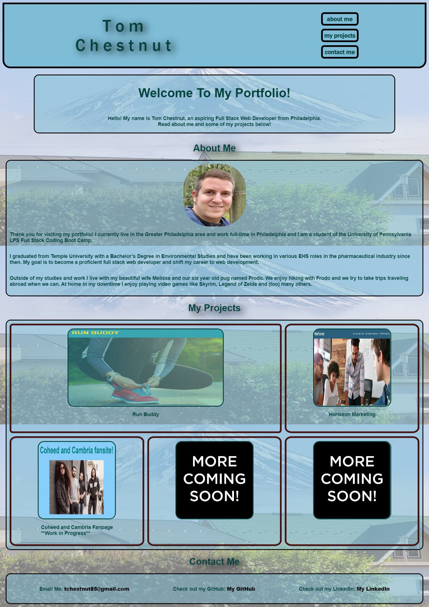

# Tom Chestnut's Portfolio

## About My Portfolio:
This website is a portfolio linking to projects I have created or worked on. I am currently taking University of Pennsylvania's Full Stack Coding Bootcamp and many of these websites were created or worked on for the Bootcamp. I will be creating personal projects very soon so please check back later.

Feel free to browse and let me know if you would like to collaborate on any projects together!

## Languages Used:
These websites have been created or worked on using HTML and CSS (so far). 

### Accessing my portfolio webpage:

The webpage can be found **[here](https://tchestnut85.github.io/)**.

